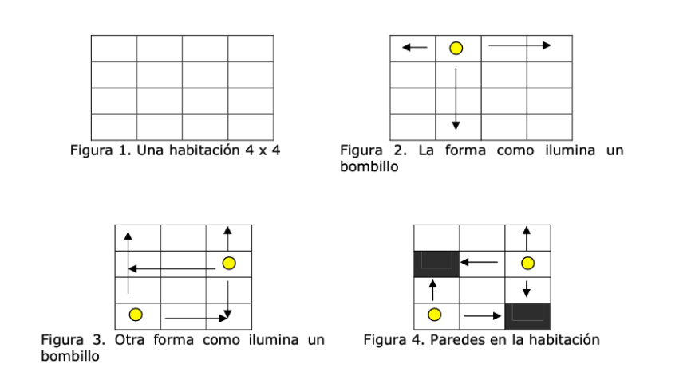

# Distribucion de bombillos
Un electricista muy cuidadoso está tratando de iluminar al más bajo costo posible las habitaciones de sus clientes. Las habitaciones que él ilumina, siempre son habitaciones en forma de matriz (Ver figura 1). Como los bombillos son muy costosos, él trata de iluminar toda la habitación utilizando la menor cantidad de los mismos.

Los bombillos sólo tiene alcance de iluminar la habitación de forma horizontal y de forma vertical (Ver figura 2 y figura 3).

Lo único malo es que las habitaciones pueden tener paredes dentro de ellas, en cuyo caso, se interrumpiría el alcance de la luz de un bombillo determinado (Ver figura 4).



## Execution

```sh
$ node index < [file.txt]
```

### input example

````txt
0 0 0
1 0 0
0 0 0
0 0 1
````

### ouput > output.txt

````txt
0 💡 💡
1 💡 0
0 💡 💡
0 💡 1
````

> 💡 represents installed lights

